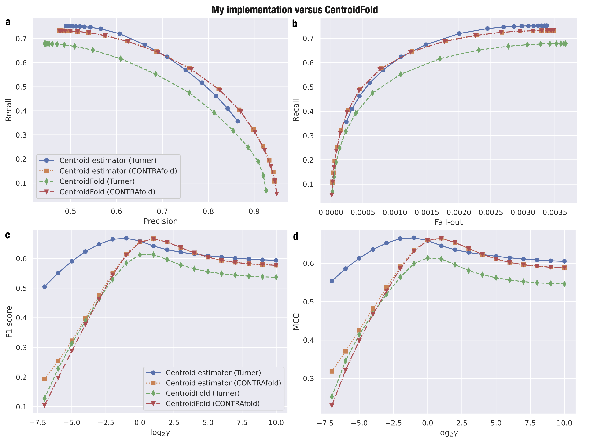

# Library of RNA Bioinformatics Algorithms
This library provides basic algorithms in RNA bioinformatics.
Current available algorithms are the [gamma-centroid structure estimator](https://academic.oup.com/bioinformatics/article/25/4/465/248190) and [McCaskill's algorithm](https://onlinelibrary.wiley.com/doi/abs/10.1002/bip.360290621).
To model RNA secondary structure scoring, [the Turner 2004 model](https://rna.urmc.rochester.edu/NNDB/) and [the CONTRAfold v2.02 model](http://contra.stanford.edu/contrafold/) are available.
More descriptions of these two scoring models are [here](https://github.com/heartsh/rna-ss-params).
The gamma-centroid structure estimator of this repository is compared to that of [CentroidFold](https://github.com/satoken/centroid-rna-package) regarding secondary structure prediction accuracy:

|
|:-:|

# Author
[Heartsh](https://github.com/heartsh)

# License
Copyright (c) 2018 Heartsh  
Licensed under [the MIT license](http://opensource.org/licenses/MIT).
